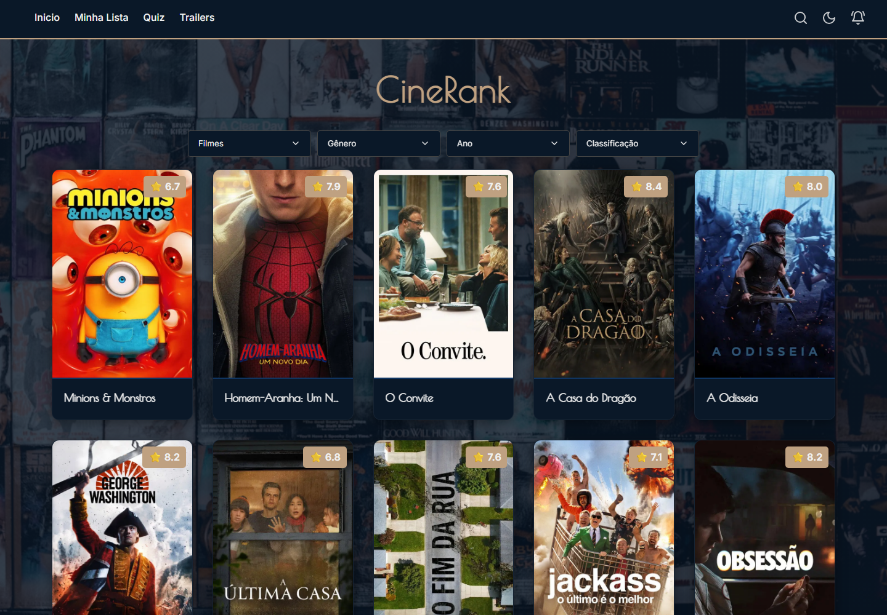
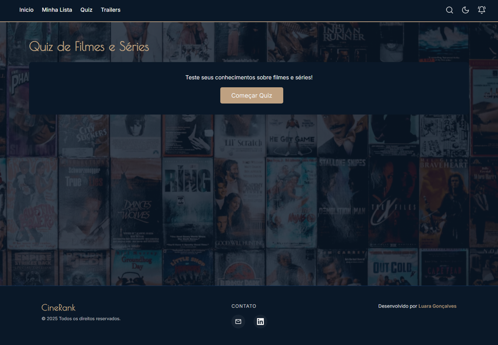

# CineRank

[](https://github.com/LuaraGoncalves/CineRank/actions/workflows/ci.yml)

CineRank é uma aplicação Next.js para descobrir filmes, séries, trailers e notícias do universo audiovisual. O projeto consome APIs externas, organiza regras em camadas, salva preferências no navegador e possui testes automatizados para proteger os fluxos principais.

## Preview

### Dashboard



### Quiz



## Destaques Técnicos

- Next.js 16 com App Router, Server Components e Server Actions.
- React 19 com componentes client/server separados por responsabilidade.
- Camada de serviços para TMDB, trailers, quiz e notícias.
- Cliente TMDB centralizado com normalização dos dados recebidos da API.
- Notícias combinando Google News RSS e NewsAPI, com cache em memória e mistura por fonte.
- Watchlist isolada em repositório, hoje usando `localStorage`.
- Tema claro/escuro salvo localmente.
- Busca global com sugestões enquanto a pessoa digita.
- Quiz com perguntas geradas a partir de filmes populares.
- ESLint, Prettier, Jest, Playwright e GitHub Actions.
- Deploy preparado para Netlify.

## Funcionalidades

- Dashboard com filmes e séries em destaque.
- Filtros por tipo, gênero, ano e classificação.
- Busca global no cabeçalho com sugestões em tempo real.
- Página de detalhes com sinopse, nota, gêneros, diretor/criador, trailers e recomendações.
- Lista de favoritos persistida no navegador.
- Quiz interativo de filmes e séries.
- Página de trailers com carregamento progressivo.
- Notificações de notícias ordenadas priorizando o dia atual.
- Tradução manual de notícias quando necessário.
- Tema claro/escuro salvo por usuário.

## Stack

- Next.js 16
- React 19
- JavaScript
- CSS puro modularizado
- Jest
- Playwright
- ESLint
- Prettier
- Netlify

## Estrutura

```txt
app/
  Rotas, Server Actions e componentes da aplicação Next.js.

src/services/
  Camada de acesso a APIs externas, normalização e regras de busca.

src/hooks/
  Hooks com regras de interface para busca, notificações e quiz.

src/repositories/
  Camada de persistência da aplicação. Hoje a watchlist usa localStorage,
  mas fica pronta para trocar por autenticação e banco no futuro.

src/core/
  Constantes, logger e armazenamento local do navegador.

src/styles/
  CSS global dividido por base, layout, componentes e utilitários.

src/utils/
  Funções utilitárias e testes simples.

tests/e2e/
  Testes end-to-end com Playwright.
```

## Rotas

- `/` - Dashboard principal
- `/filme/[id]` - Detalhes de filme ou série
- `/watchlist` - Favoritos salvos no navegador
- `/quiz` - Quiz interativo
- `/trailers` - Busca e listagem de trailers

## Variáveis de Ambiente

Crie um arquivo `.env` na raiz seguindo o modelo de `.env.example`.

```txt
TMDB_API_KEY=SuaChaveDaAPI_Aqui
NEWS_API_KEY=SuaChaveDaAPI_Aqui
NEWS_DEBUG_LOGS=false
```

`TMDB_API_KEY` é obrigatória para filmes, séries, quiz e trailers.

`NEWS_API_KEY` é opcional para notícias. Quando configurada, ela complementa o Google News RSS e ajuda a aumentar a quantidade de resultados recentes.

`NEWS_DEBUG_LOGS=true` liga logs informativos da busca de notícias. Por padrão, esses logs ficam desligados para evitar ruído em produção.

## Como Rodar Localmente

Use Node.js 22. O projeto inclui `.nvmrc` e `engines` para deixar essa versão explícita.

```bash
npm install
npm run dev
```

Depois acesse:

```txt
http://localhost:3000
```

## Scripts

```bash
npm run dev
npm run build
npm run start
npm run lint
npm run format:check
npm run format
npm test
npm run test:e2e
npm run test:e2e:ui
```

Antes de rodar os testes e2e pela primeira vez:

```bash
npx playwright install chromium
```

## Qualidade

O projeto possui GitHub Actions em `.github/workflows/ci.yml`. A pipeline executa:

```bash
npm ci
npm run format:check
npm run lint
npm test
npm run build
```

Os testes e2e com Playwright já estão preparados em `tests/e2e/`, mas ficam fora do CI principal para manter a pipeline rápida.

## Deploy

O projeto está configurado para Netlify via `netlify.toml`.

```toml
[build]
  command = "npm run build"
  publish = ".next"

[[plugins]]
  package = "@netlify/plugin-nextjs"
```

No painel da Netlify, configure:

- `TMDB_API_KEY`
- `NEWS_API_KEY`
- `NEWS_DEBUG_LOGS=false`

## Decisões Arquiteturais

- A camada `services` concentra chamadas externas e normalização, evitando regras espalhadas pelos componentes.
- A camada `repositories` isola persistência local e facilita uma futura troca para banco/autenticação.
- Server Actions funcionam como ponte entre componentes e serviços.
- O logger central evita `console.log` solto e permite controlar logs informativos por variável de ambiente.
- A ordenação de notícias considera o fuso `America/Sao_Paulo`, priorizando notícias do dia atual.

## Próximos Passos

- Adicionar o link de deploy no campo About do GitHub.
- Expandir testes e2e para busca, favoritos, tema e quiz completo.
- Evoluir watchlist para autenticação e banco de dados.
- Adicionar GIF curto demonstrando busca, favoritos e notificações.
